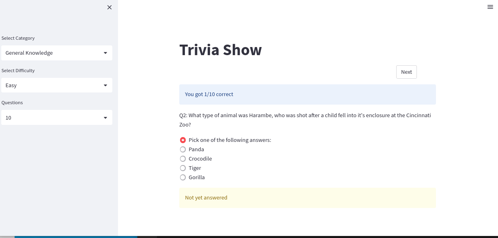

# trip-to-trivia
Trivia application in streamlit with trivia questions from open trivia  database. This application pulls trivia question from  https://opentdb.com/ based on user selections. 

# Set up virtual environment and install required packages
*  Create a new virtual env and activate it
  ``` $virtualenv venv_name```
  
    ```$source venv/bin/activate```
    
 * pip install -r requirements.txt
 
# To run the application locally

 * ```streamlit run  streamlit_trivia_app.py```
 * You can now view your Streamlit app in your browser.

  * Local URL: http://localhost:8501
  * Network URL: http://192.168.0.64:8501

# If you want to build a docker image and deploy it to AWS Elastic Beanstalk
 * ```$ sh build docker_image.sh```
 * once the image is built and uploaded to AWS ECS container, you can create Elastic Beanstalk environment and upload Deploy_trip_to_trivia.json script 


